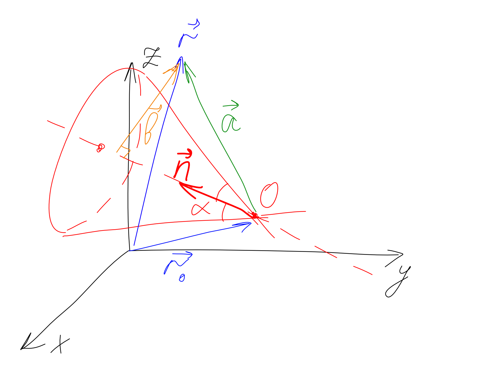

.. _surface:

Поверхность
===========

В транспортных кодах, таких как MCNP и TRIPOLI геометрическая модель строится в
`функциональном представлении
<https://en.wikipedia.org/wiki/Function_representation>`_. Ключевым элементом
здесь является *поверхность*, задаваемая с помощью некоторого уравнения
:math:`f(\mathbf{r}) = 0`. Причем каждая поверхность разбивает пространство на
два (а в общем случае, и более) подпространства. Причем в каждом из
подпространств функция :math:`f(\mathbf{r})` имеет определенный знак, по
которому эти подпространства, собственно, и различаются.

Существует 7 типов поверхностей: плоскость, сфера, цилиндр, конус, тор,
поверхности второго порядка (эллиплоид, параболоид, гиперболоид),
общая поверхность второго порядка, с помощью которой можно описать все остальные
поверхности, за исключением тора. Рассмотрим каждый из типов
поверхностей в отдельности.

1. Плоскость
------------

Чтобы однозначно задать плоскость достаточно знать координаты точки, лежащей на
этой плоскости :math:`\mathbf{r}_0`, и вектор нормали :math:`\mathbf{n}`.
Функция, описывающая плоскость имеет вид:

.. math:: f(\mathbf{r})=(\mathbf{a}, \mathbf{n})=(\mathbf{r}-\mathbf{r}_0,
   \mathbf{a})=(\mathbf{r}, \mathbf{n}) - (\mathbf{r}_0, \mathbf{n})

Здесь :math:`\mathbf{r}_0` - радиус вектор некоторой точки, принадлежащей
плоскости, :math:`\mathbf{n}` - вектор нормали к плоскости, :math:`\mathbf{r}` -
радиус-вектор проверяемой точки (см. рис. 1). Очевидно, что если проверяемая
точка принадлежит плоскости, то :math:`\mathbf{a}\perp\mathbf{n}`, и,
соответствующее скалярное произведение равно 0. Если точка лежит по одну сторону
с нормалью, то :math:`f(\mathbf{r})>0`, и если с противоположной стороны, то
:math:`f(\mathbf{r})<0`.

.. figure:: ./images/plane.png
   :scale: 25 %
   :align: center

   Рис. 1. Плоскость и векторы, которые ее определяют.

Число :math:`d=(\mathbf{r}_0, \mathbf{n})` по модулю равно расстоянию от
плоскости до начала координат, и ее знак указывает с какой стороны по отношению
к вектору нормали лежит начало координат. Градиент функции:

.. math:: \nabla f=\mathbf{n}

При преобразовании координат трансформируются :math:`\mathbf{n}` по правилу для
векторов, и :math:`\mathbf{r}_0` по правилу для точки.

2. Сфера
--------

Сфера задается с помощью координат ее центра :math:`\mathbf{r}_0` и радиуса
:math:`R`. Функция, определяющее положение точки :math:`\mathbf{r}` относительно
сферы имеет вид:

.. math:: f(\mathbf{r})=(\mathbf{r}-\mathbf{r}_0)^2 - R^2

Эта функция положительна, если точка :math:`\mathbf{r}` лежит вне сферы, и
отрицательна, если внутри. Градиент функции:

.. math:: \nabla f=2(\mathbf{r}-\mathbf{r_0})

При преобразованиях координат изменяется только положение центра сферы по
правилу для точки.

3. Цилиндр
----------

Цилиндр задается с помощью координат некоторой точки :math:`\mathbf{r}_0`,
лежащей на оси цилиндра, вектора :math:`\mathbf{n}`, задающего направление
оси цилиндра, и его радиуса :math:`R`. Функция, определяющее положение точки
:math:`\mathbf{r}` относительно цилиндра имеет вид (см. рис. 2):

.. math:: \mathbf{a}&=\mathbf{r}-\mathbf{r}_0\\
    \mathbf{b}&=\mathbf{a}-\mathbf{n}(\mathbf{a}, \mathbf{n})\\
    f(\mathbf{r})&=b^2 - R^2

Эта функция положительна, если точка :math:`\mathbf{r}` лежит вне цилиндра, и
отрицательна, если внутри. Градиент функции (при вычислении принимаем во
внимание, что :math:`\mathbf{b}\perp\mathbf{n}`):

.. math:: \nabla f=2\mathbf{b}

.. figure:: ./images/cylinder.png
   :scale: 25 %
   :align: center

   Рис. 2. Цилиндр и векторы, которые его определяют.

При преобразованиях координат трансформируется точка на оси по правилу для
точки, вектор оси по правилу для вектора.

4. Конус
--------

Конус задается с помощью координат его вершины :math:`\mathbf{r}_0`, вектора
:math:`\mathbf{n}`, задающего направление оси конуса, и угла :math:`\alpha`
между осью конуса и его образующей. На практике, нам удобнее пользоваться
тангенсом этого угла :math:`t=tg\alpha`. Также, конус разбивает пространство на
три подпространства (двулистовой конус). Функция, определяющее положение точки
:math:`\mathbf{r}` относительно конуса имеет вид (см. рис. 3):

.. math:: \mathbf{a}&=\mathbf{r}-\mathbf{r}_0\\
    f(\mathbf{r})&=a^2 - (\mathbf{a}, \mathbf{n})^2(1+t^2)

Эта функция положительна, если точка лежит вне конуса, и отрицательна, если
внутри. Градиент функции:

.. math:: \nabla f=2(\mathbf{a}-\mathbf{n}(\mathbf{a}, \mathbf{n})(1+t^2))

   Рис. 3. Конус и векторы, которые его определяют.

При преобразованиях координат трансформируется вершина конуса по правилу для
точки, вектор оси по правилу для вектора.

5. Общая поверхность второго порядка
------------------------------------

Общая поверхность второго порядка задается уравнением

.. math::
   :label: gq_eq1

   f(\mathbf{R}) = A x^2 + B y^2 + C z^2 + D x y + E y z + F x z + G x + H y +
   J z + K,

где :math:`\mathbf{R} = \{x, y, z\}`. Приравнивая в уравнении :eq:`gq_eq1`
некоторые коэффициенты 0, можно получить уравнение любой поверхности.
Преобразуем уравнение :eq:`gq_eq1` к более удобному виду:

.. math::

   f(\mathbf{R}) = \begin{pmatrix}x&y&z\end{pmatrix}\begin{pmatrix}A&
   \frac{1}{2}D&\frac{1}{2}F\\ \frac{1}{2}D&B&\frac{1}{2}E\\ \frac{1}{2}F&
   \frac{1}{2}E&C\end{pmatrix}\begin{pmatrix}x\\y\\z\end{pmatrix} +
   \begin{pmatrix}G&H&J\end{pmatrix}\begin{pmatrix}x\\y\\z\end{pmatrix} + K

или же

.. math:: f(\mathbf{R}) = \mathbf{R}^T M \mathbf{R} + \mathbf{V}^T \mathbf{R} + K,
   :label: gq_eq

где :math:`M = \begin{pmatrix}A&\frac{1}{2}D&\frac{1}{2}F\\
\frac{1}{2}D&B&\frac{1}{2}E\\ \frac{1}{2}F&\frac{1}{2}E&C\end{pmatrix}` -
симметричная матрица, :math:`\mathbf{V} = \begin{pmatrix}G\\H\\J\end{pmatrix}`.
Все рассмотренные ниже типы поверхностей являются частными случаями
поверхностей данного типа. Кроме того, цилиндр, конус, эллиплоид, гиперболоид
и параболоид с осями, непараллельными осям координат тоже описываются
исключительно общей поверхностью второго порядка.

Поскольку матрица :math:`M`, входящая в уравнение :eq:`gq_eq` является
вещественной и симметричной, то она может быть всегда приведена к диагональному
виду с помощью ортогонального преобразования. А диагональный вид матрицы
:math:`M` уравнения :eq:`gq_eq` соответствует одному из рассмотренных выше
типов поверхностей.

Градиент функции:

.. math:: \nabla f=2 M \mathbf{R} + \mathbf{V}

2. Плоскость
^^^^^^^^^^^^

Плоскость задается с помощью четырех параметров: вектора нормали к поверхности
и свободного члена, определяющего расстояние от плоскости до начала координат.
Уравнение плоскости имеет вид

.. math:: A x + B y + C z - D = 0

Это уравнение можно переписать в виде:

.. math:: S(\mathbf{R}) = \mathbf{V}^T \mathbf{R} + K,
   :label: plane_eq

где :math:`\mathbf{V} = \begin{pmatrix}A\\B\\C\end{pmatrix}`, :math:`K = -D`.
Уравнение :eq:`plane_eq` можно получить из :eq:`gq_eq`, если положить матрицу
:math:`M` нулевой. Помимо этого, в MCNP существует еще три более простых формы
задания плоскости - это случаи, когда плоскость перпендикулярна одной из осей
координат, и плоскость задается одним параметром :math:`D`, а вектор нормали
определяется спецификатором типа поверхности. Уравнение поверхности в этом
случае имеет вид

.. math::

   &PX&:\; x - D = 0;\;\; \mathbf{V}=\{1, 0, 0\}\\
   &PY&:\; y - D = 0;\;\; \mathbf{V}=\{0, 1, 0\}\\
   &PZ&:\; z - D = 0;\;\; \mathbf{V}=\{0, 0, 1\}

3. Сфера
^^^^^^^^

Сфера задается с помощью четырех параметров: координат центра сферы
:math:`(x_0, y_0, z_0)` и радиуса. В общем случае уравнение сферы имеет вид:

.. math:: (x-x_0)^2+(y-y_0)^2+(z-z_0)^2=R^2

Раскрыв скобки, данное уравнение можно привести к виду :eq:`gq_eq`, где

.. math::

   M = \begin{pmatrix}1&0&0\\0&1&0\\0&0&1\end{pmatrix}, \;
   \mathbf{V} = -2\begin{pmatrix}x_0\\y_0\\z_0\end{pmatrix}, \;
   K = x^2_0+y^2_0+z^2_0-R^2

Выделяют еще четыре более простых разновидности сферической поверхности:

.. math::

   &SO&: \; x^2+y^2+z^2=R^2\\
   &SX&: \; (x-x_0)^2+y^2+z^2=R^2\\
   &SY&: \; x^2+(y-y_0)^2+z^2=R^2\\
   &SZ&: \; x^2+y^2+(z-z_0)^2=R^2

4. Цилиндр
^^^^^^^^^^

Ось цилиндра должна быть параллельна одной из осей координат. Рассмотрим
цилиндр, параллельный оси x, и радиусом R. В общем случае он описывается
уравнением

.. math::

   (y - y_0)^2 + (z - z_0)^2 - R^2 = 0

Раскрыв скобки, получим:

.. math::

   y^2 + z^2 - 2 y y_0 - 2 z z_0 + y_0^2 + z_0^2 - R^2 = 0

Сопоставляя полученное уравнение с уравнениями :eq:`gq_eq1` и :eq:`gq_eq`,
можно записать, что для цилиндра, параллельного оси x (C/X), можно описать
уравнением :eq:`gq_eq` с параметрами

.. math::
   M = \begin{pmatrix}0&0&0\\0&1&0\\0&0&1\end{pmatrix},
   \mathbf{V} = -2\begin{pmatrix}0\\y_0\\z_0\end{pmatrix},
   K = y_0^2 + z_0^2 - R^2
   :label: cyl_params

Аналогичным образом можно определить параметры цилиндра, параллельного оси y
(C/Y):

.. math::
   M = \begin{pmatrix}1&0&0\\0&0&0\\0&0&1\end{pmatrix},
   \mathbf{V} = -2\begin{pmatrix}x_0\\0\\z_0\end{pmatrix},
   K = x_0^2 + z_0^2 - R^2

и для цилиндра, параллельного оси z (C/Z):

.. math::
   M = \begin{pmatrix}1&0&0\\0&1&0\\0&0&0\end{pmatrix},
   \mathbf{V} = -2\begin{pmatrix}x_0\\y_0\\0\end{pmatrix},
   K = x_0^2 + y_0^2 - R^2

5. Конус
^^^^^^^^

Конус также должен быть параллелен одной из осей координат. Рассмотрим конус с
вершиной в точке :math:`(x_0, y_0, z_0)`, с осью, параллельный оси x. Его можно
описать уравнением

.. math::

   (y - y_0)^2 + (z - z_0)^2 - t^2 (x - x_0)^2 = 0

Раскроем скобки:

.. math::

   y^2 + z^2 - t^2 x^2 - 2 y y_0 - 2 z z_0 + 2 t^2 x x_0 + y_0^2 + z_0^2 -
   t^2 x_0^2 = 0

Сопоставляя полученное уравнение с уравнениями :eq:`gq_eq1` и :eq:`gq_eq`,
можно записать, что конус, параллельный оси x (K/X), описывается уравнением
:eq:`gq_eq` с параметрами

.. math::
   M = \begin{pmatrix}-t^2&0&0\\0&1&0\\0&0&1\end{pmatrix},
   \mathbf{V} = -2\begin{pmatrix}-t^2 x_0\\y_0\\z_0\end{pmatrix},
   K = -t^2 x_0^2 + y_0^2 + z_0^2

Параметр :math:`t = tg\alpha`, где :math:`\alpha` - угол между осью и
образующей конуса. По аналогии можно записать параметры конуса, параллельного
оси y (K/Y):

.. math::
   M = \begin{pmatrix}1&0&0\\0&-t^2&0\\0&0&1\end{pmatrix},
   \mathbf{V} = -2\begin{pmatrix}x_0\\-t^2 y_0\\z_0\end{pmatrix},
   K = x_0^2 - t^2 y_0^2 + z_0^2

и, параллельного оси z (K/Z):

.. math::
   M = \begin{pmatrix}1&0&0\\0&1&0\\0&0&-t^2\end{pmatrix},
   \mathbf{V} = -2\begin{pmatrix}x_0\\y_0\\-t^2 z_0\end{pmatrix},
   K = x_0^2 + y_0^2 - t^2 z_0^2

В MCNP конус может быть одно- и двух- листовым. Реализован будет только двух-
листовой конус, а одно-листовой будет заменяться на конус с плоскостью.

6. Эллипсоид, гиперболоид, параболоид
^^^^^^^^^^^^^^^^^^^^^^^^^^^^^^^^^^^^^

Данный тип поверзности (SQ) описывает поверхность второго порядка, такие как
эллипсоид, гиперболоид и параболоид, с осями симметрии, параллельными осям
координат, и описывается уравнением:

.. math::

   A (x - x_0)^2 + B (y - y_0)^2 + C (z - z_0)^2 + 2 D (x - x_0) +
   2 E (y - y_0) + 2 F (z - z_0) + G = 0

Раскроем скобки и перегруппируем:

.. math::

   A x^2 + B y^2 + C z^2 + 2 x (D - A x_0) + 2 y (E - B y_0) + 2 z (F - C z_0)
   + A x_0^2 + B y_0^2 + C z_0^2 - 2 D x_0 - 2 E y_0 - 2 F z_0 + G = 0

Сопоставляя полученное уравнение с уравнениями :eq:`gq_eq1` и :eq:`gq_eq`,
можно записать, что для поверхности типа SQ параметры равны

.. math::
   M = \begin{pmatrix}A&0&0\\0&B&0\\0&0&C\end{pmatrix},
   \mathbf{V} = 2\begin{pmatrix}D - A x_0\\E - B y_0\\F - C z_0\end{pmatrix},
   K = A x_0^2 + B y_0^2 + C z_0^2 - 2 D x_0 - 2 E y_0 - 2 F z_0 + G

7. Тор
^^^^^^

Ось симметрии тора должна быть параллельна одной из осей координат. Причем
преобразования координат, при которых данное условие нарушается, в MCNP
запрещены. Уравнения тора может иметь вид:

.. math::

   TX: \frac{(x - x_0)^2}{B^2} + \frac{(\sqrt{(y - y_0)^2 + (z - z_0)^2} - A)^2}
   {C^2} - 1 = 0\\
   TY: \frac{(y - y_0)^2}{B^2} + \frac{(\sqrt{(x - x_0)^2 + (z - z_0)^2} - A)^2}
   {C^2} - 1 = 0\\
   TZ: \frac{(z - z_0)^2}{B^2} + \frac{(\sqrt{(x - x_0)^2 + (y - y_0)^2} - A)^2}
   {C^2} - 1 = 0

Точка с координатами :math:`(x_0, y_0, z_0)` является центром тора; Числа A, B
и C определяют форму тора и сохраняются при допустимых преобразованиях
координат.

Реализация классов поверхностей
-------------------------------

Будем задавать поверхности в локальной системе координат, такой, в которой
уравнение поверхности выглядит наиболее просто. Каждой поверхности
соответствует трансформация, которая переводит поверхность из локальной
системы координат в основную. Локальную систему координат будем выберать так,
чтобы ось :math:`z` совпала с осью симметрии (выделенным направлением)
поверхности. Этот выбор продиктован алгоритмом ортогонализации векторов.

Поскольку для общей поверхности второго порядка можно найти такую локальную
систему координат, в которой она выглядит наиболее просто, то набор классов
поверхностей булет ограничен следующим множеством: плоскость, сфера, цилиндр,
конус, эллипсоид, гиперболоид, параболоид, тор. При этом у всех этих класов
будут общие свойства и методы, которые не всегда можно в общем виде
реализовать. Поэтому разумно выделить для всех классов поверхностей общий
абстрактный класс-предок Surface. Общие для всех свойства:

#) трансформация (_tr) - это трансформация для перехода из глобальной системы
   координат в локальную. Это сделано для того, чтобы наиболее просто проводить
   тесты точек (с какой стороны поверхности они находятся).

Общие для всех классов методы:

#) test_point(p) - проверяет, по какую сторону нормали лежит точка p по
   отношению к поверхности (зависит от класса).

#) apply_transform(tr) - трансформирует данную поверхность (зависит от класса).

#) get_parameters() - возвращвет параметры поверхности в лабораторной системе
   отсчета.

#) equals(surf, bbox) - проверяет равенство поверхностей (зависит от класса).

О равенстве поверхностей
^^^^^^^^^^^^^^^^^^^^^^^^

Необходимо определить, какие поверхности можно считать одинаковыми с нейторой
точностью. Если имеется небольшое расхождение по направлению между осями
симметрии поверхностей, то различие между ними будет нарастать по мере удаления
от точки пересечения; при этом поверхности можно считать одинаковыми в
некоторой ограниченной области пространства :math:`B` (bounding box). Поэтому
пусть расстояние между двумя точками, на котором их можно считать одинаковыми
равно :math:`\delta r`. Тогда, если расстояние между всеми точками
поверхностей, попадающих в ограничивающий объем не превышает :math:`\delta r`,
то эти поверхности можно считать одинаковыми. Несмотря на подобный подход,
критерий для :ref:`равенства трансформаций <transform_equality>` является
слишком строгим. Поэтому критерий для равенства поверхностей необходимо
выбирать для каждого типа индивидуально.

Классы поверхностей
^^^^^^^^^^^^^^^^^^^

1. Плоскость (Plane)
%%%%%%%%%%%%%%%%%%%%

У плоскости выделенным направлением является направление нормали. Поэтому
выберем локальную систему координат так, чтобы в ней уравнение плоскости имело
вид :math:`z=0`. Преобразование из глобальной системы координат в локальную
осуществляется с помощью трансформации *_tr*, которая задается с помощью
матрицы вращения :math:`U` и вектора трансформации :math:`\mathbf{T}`.

Рассмотрим условие равенства плоскостей. Пусть есть еще одна плоскость,
преобразование координат из локальной системы которой в глобальную задается с
помощью матрицы :math:`U_0` и вектора :math:`\mathbf{T}_0` (трансформация
*_tr0*. Максимальное расстояние между плоскостями будет достигаться на границах
области :math:`B`. Поэтому для определения близости плоскостей постумим
следующим образом.

#) Найдем координаты всех вершин параллепипеда :math:`B` в локальной системе
   координат первой плоскости. Для этого необходимо применить трансформацию
   *_tr* к координатам соответствующей вершины. Модуль координаты :math:`z`
   соответствующего результата будет равен расстоянию от этой вершины до
   плоскости.

#) Найдем координаты всех вершин параллепипеда :math:`B` в локальной системе
   координат второй плоскости (аналогично предыдущему пункту).

#) Для каждой из точек выберем наиболее близкую плоскость (это нужно, чтобы
   результат сравнения не зависел от порядка выбора плоскостей), и найдем
   проекцию на эту плоскость (положив :math:`z=0` для соответствующей локальной
   системы координат). И найдем расстояние (от найденной проекции) до другой
   плоскости (надо найти координаты точки проекции в локальной системе другой
   плоскости).

#) Из найденных в предыдущем пункте расстояний выберем наибольшее. Если оно
   меньше :math:`\delta r`, то плоскости можно считать одинаковыми.

В локальной системе координат уравнение плоскости (см. :eq:`plane_eq`) задается
с помощью вектора :math:`\mathbf{V}=\{0,0,1\}` и числа :math:`K=0`. Чтобы
найти уравнение плоскости в глобальной системе координат необходимо найти
трансформацию, обратную к *_tr*, с помощью которой найти соответствующие
:math:`\mathbf{V}` и :math:`K` в глобальной системе координат. При этом,
если результирующий вектор :math:`\mathbf{V}` параллелен одной из осей
координат, то можно записать упрощенное уравнение поверхности.

.. warning:: В отличие от всех остальных поверхностей, одна и та же плоскость
   может быть задана двумя способами: нормаль к плоскости может быть направлена
   как в одну сторону, так и в противоположную. Это может привести к проблемам
   при упрощении/замене одинаковых плоскостей.

2. Сфера (Sphere)
%%%%%%%%%%%%%%%%%

Локальную систему координат для сферы выберем так, чтобы ее центр лежал в
начале координат. Тогда единственными параметроми, характеризующим сферу будут
ее радиус :math:`R`, и трансформация *_tr* из глобальной системы координат в
локальную.

Вращения локальной системы координат на сферу никак не повлияют. Поэтому для
равенства двух сфер необходимо, чтобы с некоторой точностью совпадали их центры
и радиусы. Тогда условие равенства двух сфер можно записать в виде

.. math:: |R_1-R_2|+|\mathbf{T}_1-\mathbf{T}_2|<\delta r,

где :math:`\mathbf{T}` - вектор трансляции для преобразования из локальной
системы координат в глобальную (обратной к *_tr*).

Упрощенное представление сферы может быть получено в некоторых случаях:

* :math:`|\mathbf{T}|<\delta r` - сфера в начале координат - тип *SO* ;

* :math:`|\mathbf{T}-\mathbf{T}_x|<\delta r` - сфера на оси :math:`x` -
  тип *SX* ;

* :math:`|\mathbf{T}-\mathbf{T}_y|<\delta r` - сфера на оси :math:`y` -
  тип *SY* ;

* :math:`|\mathbf{T}-\mathbf{T}_z|<\delta r` - сфера на оси :math:`z` -
  тип *SZ* ;

3. Цилиндр (Cylinder)
%%%%%%%%%%%%%%%%%%%%%

Цилиндр имеет выделенное направление. Выберем локальную систему координат так,
что ось цилиндра совпадает с осью :math:`z` и проходит через начало координат.
При таких ограничениях единственными параметроми цилиндра будет его радиус
:math:`R` и трансформация *_tr* для перехода из глобальной системы координат в
локальную.

Рассмотрим вопрос о равентсве цилиндров. Пусть есть два цилиндра с радиусами
:math:`R_1` и :math:`R_2`, и трансформациями *tr1* и *tr2*. Наибольшее
расхождение цилиндров будет на одной из границ параллепипеда :math:`B`. Тогда
поступим по аналогии для случая с плоскостью.

#) Найдем координаты точек вершин параллепипеда :math:`B` в локальных системах
   координат первого и второго цилиндров. Т.к. ось цилиндра совпадает с осью
   :math:`z`, то расстояние от точки до оси цилиндра будет :math:`\sqrt{x^2+
   y^2}`.

#) Для каждой из точек выберем наиболее близкую ось (это нужно, чтобы
   результат сравнения не зависел от порядка выбора цилиндров), и найдем
   проекцию на эту ось (положив :math:`x=0` и :math:`y=0` для соответствующей
   локальной системы координат). И найдем расстояние (от найденной проекции) до
   другой оси (надо найти координаты точки проекции в локальной системе другого
   цилиндра).

#) Из найденных в предыдущем пункте расстояний выберем наибольшее
   :math:`R_{max}`. Тогда, если :math:`R_{max}+|R_1-R_2|<\delta r`, то цилиндры
   можно считать одинаковыми.

4. Конус (Cone)
%%%%%%%%%%%%%%%

Конус имеет выделенное направление. Выберем локальную систему координат так, что
ось конуса совпадает с осью :math:`z` и проходит через начало координат. При
таких ограничениях единственными параметрами конуса будут тангенс угла между
образующей конуса и его осью :math:`t_a` и трансформация *_tr*.

Рассмотрим вопрос о равенстве конусов. Пусть есть два конуса с тангенсами угла
:math:`t_1` и :math:`t_2`, и трансформациями *tr1* и *tr2*. Для равентва
конусов необходимо, чтобы совпали (с какой-то точностью) их вершины, оси и
тангенсы углов.

Для того, чтобы совпали вершины конусов необходимо выполнение условия

.. math:: |\mathbf{T}_1-\mathbf{T}_2|<\delta r,

где :math:`\mathbf{T}` - вектор трансляции для преобразования из локальной
системы координат в глобальную (обратной к *_tr*).

Процедура определения факта равенства осей такая же как и для цилиндров.
В результате найдем максимальное расстояние между осями :math:`R_{max}`.
Помимо этого нужно будет сохранить расстояние до верщины конуса, при котором
оси расходятся на максимальное расстояние :math:`H_{max}` (соответствует
координате :math:`z`). Радиусы конусов на таком удалении от вершины будут равны
соответствнно :math:`R_1=H_{max}t_1` и :math:`R_2=H_{max}t_2`. Тогда условие
равенства конусов можно записать в виде:

.. math::

   \begin{cases}
   &|\mathbf{T}_1-\mathbf{T}_2|<\delta r\\
   &R_{max}+|R_1-R_2|<\delta r
   \end{cases}

5. Эллипсоид (Ellipsoid)
%%%%%%%%%%%%%%%%%%%%%%%%

Чтобы упростить сравнение выберем локальную систему координат так, чтобы центр
эллипсоида был в начале координат, а наибольшая ось совпала с осью :math:`x`, а
наименьшая с осью :math:`z`. Тогда эллипсоид задается с помощью трансформации
*_tr* и трех радиусов *A*, *B* и *C* (в порядке убывания).

Рассмотрим вопрос равентсва эллипсоидов. Чтобы два эллипсоида были равны,
необходимо, чтобы совпали их центры, радиусы и направления осей с некоторой
точностью.

Для того, чтобы совпали центры эллипсоидов необходимо выполнение условия

.. math:: |\mathbf{T}_1-\mathbf{T}_2|<\delta r,

где :math:`\mathbf{T}` - вектор трансляции для преобразования из локальной
системы координат в глобальную (обратной к *_tr*).

Выберем точки на осях первого эллипсоида :math:`(A_1,0,0)`, :math:`(0,B_1,0)` и
:math:`(0,0,C_1)`, и найдем их координаты в локальной системе второго эллипсоида.
Спроецируем эти точки на координатные оси (в системе координат второго
эллипсоида). Расстояния от этих точек до соответствующих проекций :math:`D_a`,
:math:`D_b` и :math:`D_c` дадут оценку отклонения осей. Поскольку отклонение
из-за несовпадения осей перпендикулярно отклонению из-за несовпадения радиусов,
то условие равенства эллипсоидов можно записать в виде

.. math::

   \begin{cases}
   &|\mathbf{T}_1-\mathbf{T}_2|+<\delta r\\
   &\sqrt{D^2_a+(A_1-A_2)^2}<\delta r\\
   &\sqrt{D^2_b+(B_1-B_2)^2}<\delta r\\
   &\sqrt{D^2_c+(C_1-C_2)^2}<\delta r
   \end{cases}

6. Гиперболоид (Hyperboloid)
%%%%%%%%%%%%%%%%%%%%%%%%%%%%

7. Параболоид (Paraboloid)
%%%%%%%%%%%%%%%%%%%%%%%%%%

8. Тор (Torus)
%%%%%%%%%%%%%%

Тор имеет выделенное направление. Выберем локальную систему координат так, что
центр тора будет лежать в начале координат, а ось тора будет совпадать с осью
:math:`z`. Тогда параметрами тора будут: трансформация *_tr*, радиус :math:`A`,
радиус сечения, параллельный оси тора (:math:`z`) :math:`B`, и радиус,
перпендикулярный оси тора :math:`C`.

Чтобы два тора были равны необходимо совпадение их центров:

.. math:: |\mathbf{T}_1-\mathbf{T}_2|<\delta r,

где :math:`\mathbf{T}` - вектор трансляции для преобразования из локальной
системы координат в глобальную (обратной к *_tr*). Помимо этого их оси не
должны сильно отличаться. Оси торов направлены вдоль оси :math:`z`. Поэтому
найдем векторы :math:`\mathbf{e}_z` локальных систем координат сравниваемых
торов в глобальной системе координат. Их скалярное произведение даст значение
:math:`\cos{\alpha}`, где :math:`\alpha` - угол между осями торов. Для
краткости назовем кольцом окружность радиусом :math:`A` c с центром,
совпадающим с центром тора, и лежащей в плоскости, перпендикулярной оси тора.
Тогда максимальное отклонение колец вследствие поворотов систем координат
равно :math:`\delta c=\sqrt{A_1^2+A_2^2-2A_1A_2|\cos{\alpha}|}`. Обозначим как
:math:`\mathbf{T}_{||}` составляющую вектора расстояния между центрами
торов, параллельную осям. Тогда торы можно считать одинаковыми, если выполнено
условие

.. math::

   \begin{cases}
   &|\mathbf{T}_1-\mathbf{T}_2|<\delta r\\
   &\sqrt{(|B_1-B_2|+\delta c+\mathbf{T}_{||})^2+(|A_1-A_2|+|C_1-C_2|+
   |\mathbf{T}-\mathbf{T}_{||}|)^2}<\delta r
   \end{cases}
